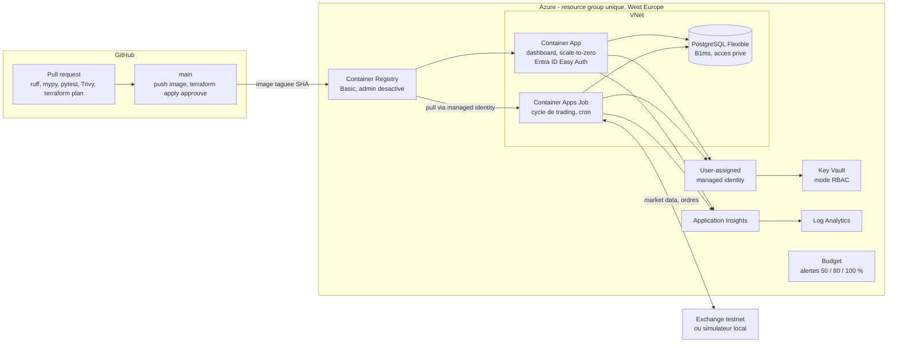
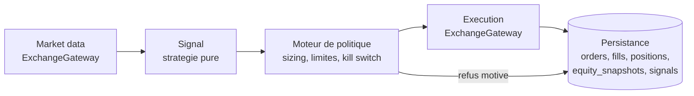

# azure-trading-platform

Plateforme d'exécution d'un bot de trading en **paper trading** sur Azure.

Projet portfolio. L'objectif est de démontrer des pratiques d'ingénierie de
production : infrastructure as code, CI/CD, gestion des secrets, observabilité et
maîtrise des coûts. **La rentabilité du bot n'est pas un objectif** et la
stratégie est volontairement simple et lisible.

## Avertissement

Ce projet ne trade pas d'argent réel et n'en a pas la capacité. Il tourne contre
un testnet d'exchange ou contre un simulateur déterministe local. Le code refuse
de démarrer si le mode sandbox n'est pas actif, et l'énumération des backends
d'exécution ne comporte aucun membre `live`. Ce n'est pas un conseil en
investissement.

## État d'avancement

Le projet est construit par phases. Ce tableau reflète ce qui existe réellement
dans le dépôt, pas ce qui est prévu.

| Phase | Contenu | État |
|---|---|---|
| 1 | Scaffolding, CLAUDE.md, pre-commit, garde-fou sandbox | fait |
| 2 | Bot en local, docker compose avec Postgres, tests | fait |
| 3 | Bootstrap du state Terraform, infra dev | à faire |
| 4 | CI/CD GitHub Actions avec OIDC | à faire |
| 5 | Observabilité, alertes, workbook, dashboard | à faire |
| 6 | Documentation, ADR, runbook, nettoyage | à faire |

## Architecture visée



### Pipeline du cycle de trading



Chaque étape a une entrée et une sortie typées (contrats Pydantic dans
`domain/`). `strategy/` et `policy/` sont purs : pas d'I/O, pas de lecture
d'horloge. Tout l'accès à l'exchange passe par `ExchangeGateway`, seul endroit où
l'invariant sandbox est appliqué et auditable.

## Structure du dépôt

```
src/trading_bot/
  domain/            contrats Pydantic échangés entre les étages
  exchange/          tout l'I/O venue : protocole, simulateur, ccxt sandbox
  strategy/          pur : bougies en entrée, Signal en sortie
  policy/            pur et déterministe : limites de risque, sizing, kill switch
  execution/         application des fills au grand livre
  persistence/       modèles SQLAlchemy et accès aux données
  observability/     logs JSON structurés et masquage des secrets
  cycle.py           orchestration d'un cycle
  bootstrap.py       composition root : c'est le seul module qui choisit un backend
  __main__.py        point d'entrée du job
migrations/          Alembic
tests/unit/          aucune dépendance externe
tests/integration/   nécessite Postgres, marquées `integration`
infra/bootstrap/     state distant Terraform, appliqué une seule fois
infra/modules/       modules Terraform réutilisables
infra/envs/dev/      composition de l'environnement dev
docs/adr/            une ADR par décision structurante
docs/runbook.md      procédures d'incident
.github/             workflows CI/CD et Dependabot
```

### Modèle de données

| Table | Rôle |
|---|---|
| `signals` | ce que la stratégie a conclu, y compris les `hold`, avec son contexte |
| `orders` | une ligne par intention soumise, avec le motif de la décision |
| `fills` | exécutions rattachées à un ordre |
| `positions` | position courante par symbole, coût moyen pondéré |
| `equity_snapshots` | photo de l'equity à chaque cycle, source du cash et du drawdown |

Un refus est enregistré au même titre qu'un ordre : la question « pourquoi le bot
n'a rien fait à 14 h 00 » doit avoir une réponse dans la base.

## Démarrage local

Prérequis : [uv](https://docs.astral.sh/uv/) et Docker.

```bash
make install            # crée le venv en Python 3.12 depuis pyproject.toml
make hooks              # installe les hooks pre-commit
make check              # ruff, mypy, pytest
make test-integration   # démarre Postgres et lance aussi les tests d'intégration
make cycle              # un cycle en local contre Postgres dans Docker
make up                 # un cycle dans le conteneur, comme le fera le Job
make down               # arrête tout et supprime le volume
```

Les tests d'intégration se skippent d'eux-mêmes si `TEST_DATABASE_URL` n'est pas
défini, donc `make check` reste utilisable sans Docker.

Copier `.env.example` vers `.env` pour les réglages locaux. `.env` est ignoré par
git et par gitleaks. Sur Azure ces valeurs viennent de Key Vault via managed
identity, pas d'un fichier.

Le backend par défaut est `simulated` : aucune clé, aucun réseau. Pour viser le
testnet Binance, passer `BOT_EXCHANGE_BACKEND=ccxt_sandbox` et fournir des clés
testnet sans permission de retrait.

## Coûts

Estimation à recalculer sur l'[Azure Pricing
Calculator](https://azure.microsoft.com/pricing/calculator/) avant tout déploiement,
les prix bougent et dépendent de la région.

| Ressource | Ordre de grandeur mensuel |
|---|---|
| PostgreSQL Flexible Server B1ms + stockage | le poste dominant |
| Container Apps, consommation, scale-to-zero | faible |
| Log Analytics, ingestion au-delà du quota gratuit | variable, dépend du volume de logs |
| Container Registry Basic | fixe et faible |
| Key Vault, VNet, Private DNS | négligeable |

L'abonnement est un essai gratuit de 200 USD sur 30 jours. La conséquence
opérationnelle est que l'environnement doit pouvoir être détruit et recréé en une
commande, ce qui est une contrainte de conception, pas un confort. Un
`azurerm_consumption_budget_resource_group` déclenche des alertes à 50, 80 et
100 %.

## Décisions d'architecture

- [ADR-0001](docs/adr/0001-record-architecture-decisions.md) — tenir un registre de décisions
- [ADR-0002](docs/adr/0002-container-apps-over-aks.md) — Container Apps plutôt qu'AKS
- [ADR-0003](docs/adr/0003-scheduled-job-over-long-running-process.md) — job planifié plutôt que processus permanent
- [ADR-0004](docs/adr/0004-exchange-gateway-abstraction.md) — abstraction exchange et simulateur déterministe
- [ADR-0005](docs/adr/0005-the-database-is-the-authoritative-ledger.md) — la base fait foi, pas la venue
- [ADR-0006](docs/adr/0006-idempotent-cycles.md) — une bougie, un identifiant de cycle

## Licence

MIT, voir [LICENSE](LICENSE).

---

## English summary

`azure-trading-platform` runs a **paper trading** bot on Azure. It is a portfolio
project: the point is the operational engineering around the bot, not the
strategy's returns.

The trading cycle runs as a cron-scheduled Azure Container Apps Job. Market data,
signal, a deterministic policy engine enforcing position and daily-loss limits
plus a kill switch, then execution. State is persisted to a privately networked
PostgreSQL Flexible Server. A scale-to-zero FastAPI dashboard behind Entra ID
Easy Auth reads it back.

Infrastructure is Terraform with remote state, deployed by GitHub Actions
authenticating through OIDC federated credentials, with a manually approved
environment gating `terraform apply`. Secrets live in Key Vault and are read
through a user-assigned managed identity.

There is no live trading code path. Configuration validation refuses to start the
process outside sandbox mode, and the execution backend enum has no live member.
This is enforced by unit tests and documented in
[CLAUDE.md](CLAUDE.md).

Build status: phase 2 of 6 complete. See the progress table above for what
actually exists today.
